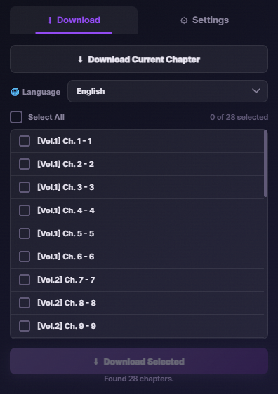

<p align="center">
<picture>
  <source media="(prefers-color-scheme: dark)" srcset="https://capsule-render.vercel.app/api?type=waving&color=0:8b5cf6,100:34d399&height=200&section=header&text=MangaDex%20Downloader&fontSize=50&fontColor=fff&animation=fadeIn">
  
</picture>
</p>

<p align="center">
  
</p>

<p align="center">
  <strong>A beautiful Chrome extension for downloading manga from MangaDex.</strong><br>
  Batch download entire series with one click. Choose your format.<br>
  All inside a sleek dark-themed popup.
</p>

<p align="center">
  
  
</p>

---

<p align="center">
  <sub><em>Browse a manga on MangaDex → Open the extension → Pick your chapters → Download.</em></sub>
</p>

## ✨ Features

| | Feature | |
|---|---|---|
| 📚 | **Batch download** — queue entire series at once | 🚀 |
| 📦 | **Multiple formats** — images, ZIP/CBZ, or PDF | 🎨 |
| ⚡ | **Data-saver mode** — 57% smaller files | ⚙️ |
| 🌐 | **Multi-language** — EN, PT-BR, RU, ES, FR, ID, VN | 🖱️ |
| 🎯 | **Shift+click select** — quickly pick chapter ranges | 🔄 |
| 📊 | **Live progress** — see downloads in real-time | 🎨 |
| 🌙 | **Dark theme** — easy on the eyes | |

## 🚀 Getting Started

### Installation

```bash
1. Open Chrome → chrome://extensions
2. Enable Developer mode (toggle in top-right)
3. Click "Load unpacked"
4. Select the mangadex_extension/ folder
5. Pin it to your toolbar for quick access
```

### How to Use

1. **Go to any manga** on [MangaDex](https://mangadex.org) — title page or reader
2. **Click the extension icon** in your toolbar
3. **Pick a language** and check the chapters you want
4. **Hit "Download Selected"** and watch it go

> 💡 On a chapter reader page? The extension shows a "Download Current Chapter" button — one click and you're done.

## ⚙️ Settings

| Setting | What it does |
|---|---|
| **Format** | Save as images, ZIP/CBZ archive, or PDF |
| **Concurrent Chapters** | How many chapters to download at once |
| **Concurrent Images** | How many pages to download at once per chapter |
| **Data Saver** | Smaller images (57% less data) |
| **Chapter Number** | Add "Ch.X" to folder names |

## 📁 Project Structure

```
mangadex_extension/
├── manifest.json          # Extension config
├── background.js          # The engine — queues, downloads, ZIP/PDF
├── popup.html             # Popup layout
├── popup.css              # Popup styles — dark theme
├── popup.js               # Popup logic — chapters, progress
├── settings.js            # Settings helpers
├── offscreen.html         # PDF rendering page
├── offscreen.js           # PDF generation
├── lib/                   # Third-party libraries
│   ├── jszip.min.js
│   └── jspdf.umd.min.js
└── icons/                 # Extension icons
```

## 🛠 Built With

<p align="center">
  
  
  
  
</p>

---

<p align="center">
  <sub>Made for manga readers who want their chapters offline.</sub>
</p>

<p align="center">
<picture>
  <source media="(prefers-color-scheme: dark)" srcset="https://capsule-render.vercel.app/api?type=waving&color=0:34d399,100:8b5cf6&height=120&section=footer">
  
</picture>
</p>